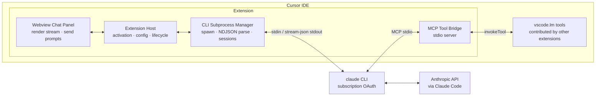

# Cursor ⇄ Claude Code Extension — Architecture Plan

A Cursor IDE extension that runs **Claude Code on your Claude subscription (Pro/Max) credits — no API key** — with its own chat panel inside Cursor, and a bridge that exposes IDE extension tools to Claude Code via MCP.

---

## 1. Overview & Goals

| Goal | How it's achieved |
|---|---|
| Use Claude subscription credits, no API key | Spawn the **official `claude` CLI binary** — subscription OAuth (`/login`) applies legitimately because the real Claude Code product is doing the work |
| Chat with Claude Code inside Cursor | Extension-owned **webview chat panel** rendering the CLI's streamed output |
| Give Claude Code access to IDE tools | Local **MCP server** that proxies extension-contributed `vscode.lm` tools, registered with `claude mcp add` |

## 2. Constraints & Non-Goals

These constraints dictate the architecture — they are not optional design choices:

- **Subscription OAuth is ToS-restricted to Claude Code / claude.ai** (Anthropic Consumer Terms, Feb 2026). OAuth tokens from Free/Pro/Max accounts may not be used in any other product or routed through third-party services. Therefore the extension must invoke the **real `claude` binary** — never the Agent SDK (API-key only) and never a token-extracting proxy.
- **Cursor's native chat panel has no extension API.** There is no supported way to inject a custom model backend into Cursor's chat/Composer or render third-party responses there. The extension must own its UI via a webview panel.
- **Cursor's proprietary tools are not exposed.** Composer apply, codebase indexing, autocomplete, etc. have no public API or MCP surface. Only tools contributed by *extensions* through the `vscode.lm` Language Model Tools API are bridgeable.

**Non-goals:**
- Replacing or intercepting Cursor's native chat/Composer.
- Wrapping subscription auth as an OpenAI-compatible endpoint for Cursor's model picker (ToS violation).
- Bridging Cursor's proprietary tools.
- Reusing any non-public Claude Code internals (e.g., the private IDE WebSocket/lock-file protocol in `~/.claude/ide/`).

## 3. Architecture

### Components

#### 3.1 Extension host (TypeScript)
- Standard VS Code extension entry point (`activate`/`deactivate`), targeting the VS Code API version Cursor ships.
- Configuration: path to the `claude` binary (auto-detect on `PATH`, allow override), default working directory (workspace root), model selection, permission mode.
- Lifecycle: owns the webview panel, the subprocess manager, and the MCP bridge server; disposes all of them cleanly on deactivate.

#### 3.2 CLI subprocess manager
- Spawns per user turn:
  `claude -p "<prompt>" --output-format stream-json --verbose`
- **Sessions:** capture `session_id` from the `init`/`result` events; continue conversations with `--resume <session_id>` so multi-turn chat works.
- **Streaming:** parse stdout as NDJSON (one JSON event per line): `system`/`init`, `assistant` message deltas, `tool_use` / `tool_result` events, final `result` with usage.
- **Error handling:** non-zero exit codes, malformed lines, process kill on panel close or new prompt (cancel), timeout guard.
- **Install/auth detection:** if the binary is missing → show install instructions; if the CLI reports it isn't logged in → instruct the user to run `claude` in a terminal and `/login` with their Claude account.

#### 3.3 Webview chat panel
- Extension-owned webview (sidebar view or editor panel) — this is the chat UI, since Cursor's native chat is off-limits.
- Renders: streamed assistant markdown, tool-use activity (collapsed cards: tool name, input summary, result), token/cost summary from the `result` event, errors.
- Input box posts the prompt to the extension host via `postMessage`; host forwards to the subprocess manager.
- Permission handling: run with an explicit `--permission-mode` (e.g. `acceptEdits` opt-in) and/or wire `--permission-prompt-tool` to an MCP tool served by the bridge, so approve/deny prompts surface as buttons in the webview instead of hanging the headless CLI.

#### 3.4 MCP tool bridge
- Small MCP server speaking **stdio**, launched by the CLI itself (registered once via `claude mcp add cursor-bridge -- <node> <bridge-entry.js>`), or served over a localhost port owned by the extension — whichever proves more reliable for sharing state with the extension host.
- On `tools/list`: enumerate `vscode.lm.tools` (name, description, input schema) and expose them as MCP tools.
- On `tools/call`: proxy to `vscode.lm.invokeTool(...)` and marshal the result back.
- **Feature-detect** the `vscode.lm` tools API at activation — Cursor is a VS Code fork and may lag or drop it. If absent, the bridge degrades gracefully (chat still works, tool bridging disabled, status shown in the panel).

## 4. Implementation Phases

### Phase 1 — Skeleton & round-trip
- Extension scaffold (esbuild/tsc, `package.json` contributes: sidebar view + command).
- Detect `claude` binary; spawn `claude -p` with plain `--output-format text`; print output into a bare-bones panel.
- **Milestone:** type a prompt in Cursor, get a Claude Code answer back on subscription auth.

### Phase 2 — Streaming, rendering, sessions
- Switch to `--output-format stream-json --verbose`; incremental NDJSON parser.
- Rich webview rendering (markdown, tool-use cards, usage footer); cancel button (kill process).
- Session continuity with `--resume`; conversation history in the panel; new-chat action.
- **Milestone:** fluid multi-turn streamed chat.

### Phase 3 — MCP tool bridge
- Implement the stdio MCP server; register with `claude mcp add` (project or user scope) on first run, with user consent.
- Enumerate + proxy `vscode.lm` tools; feature-detection and graceful degradation in Cursor.
- Optional: `--permission-prompt-tool` wired to the bridge for in-panel approvals.
- **Milestone:** Claude Code invokes an extension-contributed tool from inside Cursor.

### Phase 4 — IDE context & packaging
- Pass active editor context into prompts: file path, selection, diagnostics (as prompt preamble or `@file` references).
- Settings UI polish, error states, telemetry-free logging channel.
- Package as `.vsix`; publish to **Open VSX** (Cursor's registry); document install via `cursor:extension/...` link.
- **Milestone:** installable extension usable end-to-end by others.

## 5. Risks & Open Questions

| Risk | Likelihood | Mitigation |
|---|---|---|
| Cursor doesn't preserve the `vscode.lm` tools API | Medium–High | Feature-detect at runtime; ship chat-only mode as the baseline; bridge is additive |
| `claude` CLI flags / stream-json event schema change between releases | Medium | Pin a tested CLI version range; defensive parsing (ignore unknown event types); integration smoke test against the installed CLI |
| Headless `-p` mode blocks on permission prompts | Medium | Explicit `--permission-mode`; `--permission-prompt-tool` via the MCP bridge; document the trade-offs |
| `claude mcp add` scope/registration UX (per-project vs. user) | Low | Prefer project-scope `.mcp.json` written with user consent; fall back to instructions |
| Few useful `vscode.lm` tools installed in practice | Medium | Value must stand on the chat panel alone; tool bridge is a bonus |

## 6. Verification Checklist

Per phase, verified manually inside Cursor:

- [ ] **P1:** Extension activates in Cursor; missing-binary and not-logged-in states show actionable guidance; prompt → response round-trip works with a subscription-authenticated CLI (no `ANTHROPIC_API_KEY` set).
- [ ] **P2:** Responses stream token-by-token; tool-use events render; `--resume` preserves context across turns; cancel kills the subprocess.
- [ ] **P3:** `claude mcp list` shows the bridge; a sample `vscode.lm` tool appears in Claude Code's tool list and executes; absence of the API degrades gracefully (no crash, status message).
- [ ] **P4:** Active-file/selection context reaches the model (verify by asking "what file am I looking at?"); `.vsix` installs cleanly in a fresh Cursor profile via Open VSX.

Cross-cutting: confirm no API key is required at any point, and no OAuth token is ever read, stored, or transmitted by the extension itself — all Anthropic communication happens inside the spawned `claude` process.
